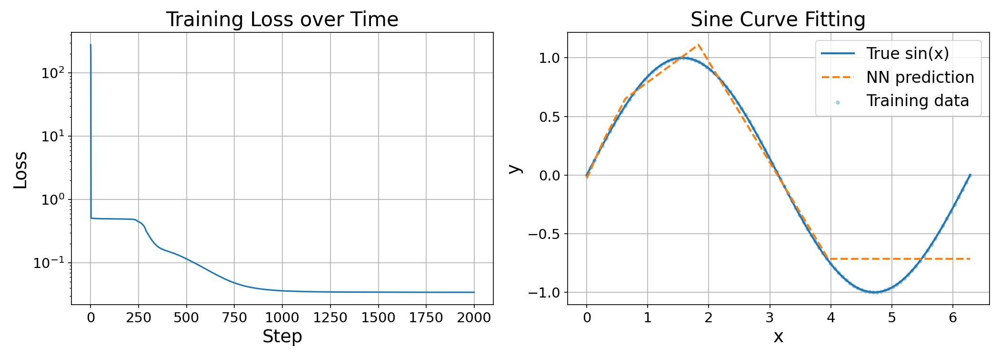

## nanojax 

<center>
<figure>

<figcaption>Computed using nanojax! See <code>examples/gaussian_derivatives.py</code></figcaption>
</figure>
</center>

A minimalist tape-based reverse-mode autodiff library with drop-in support for a subset of `numpy`. No additional dependencies are required beyond `numpy`.

This is purely an educational project, and is not intended for production use. It is not optimized for speed or memory efficiency, and supports a limited set of operations. I had fun building it, and I hope you find it interesting too!

## Usage

Use `numpy` as normal, and call `nanojax.grad` to create gradient functions!
For a list of supported operations, see the `nanojax/grad_register.py` file.

```python
import numpy as np
from nanojax import grad

def gaussian(x):
    """Standard Gaussian: exp(-x^2/2) / sqrt(2π)"""
    return np.exp(-(x**2) / 2) / np.sqrt(2 * np.pi)

grad_gaussian = grad(gaussian)
grad2_gaussian = grad(grad(gaussian))  # or grad(grad_gaussian)
grad3_gaussian = grad(grad(grad(gaussian)))  # or grad(grad2_gaussian)
# ...

# Use the gradients!
x = np.linspace(-4, 4, 200)
dy = np.array([grad_gaussian(np.array(xi)) for xi in x])
d2y = np.array([grad2_gaussian(np.array(xi)) for xi in x])
d3y = np.array([grad3_gaussian(np.array(xi)) for xi in x])
```

### Training a Neural Network
See [`examples/nn.py`](examples/nn.py) for a demonstration of a 2-layer MLP used to predict `sin(x)`.
<center>
<figure>

<figcaption>See <code>examples/nn.py</code> for the full code.</figcaption>
</figure>
</center>

```python
# Define model and loss
def forward(x, w1, b1, w2, b2):
    """2-layer neural network forward pass."""
    h = np.maximum(x @ w1 + b1, 0)
    y = h @ w2 + b2
    return y

def mse_loss(pred, target):
    """Mean squared error loss."""
    return np.mean((pred - target) ** 2)

def loss_fn(w1, b1, w2, b2):
    pred = forward(x_train, w1, b1, w2, b2)
    return mse_loss(pred, y_train)

# Get gradient of params w.r.t loss
grad_fn = grad(loss_fn, argnums=(0, 1, 2, 3), grad_direction=None)
dw1, ... = grad_fn(w1, b1, w2, b2)

# Update params
w1 = w1 - learning_rate * dw1
```

The project was inspired by [`karpathy/micrograd`](https://github.com/karpathy/micrograd/), although the approaches used are significantly different.