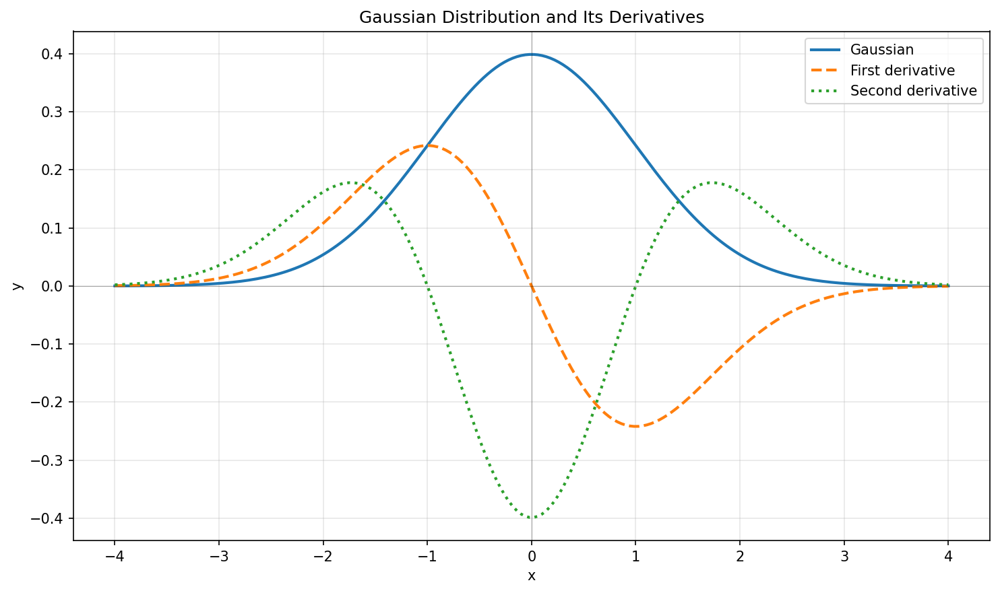

## nanojax
A small tape-based reverse-mode autodiff library with drop-in support for a subset of `numpy`.

Have you ever wanted to compute gradients of functions involving `numpy` operations, but found existing libraries like JAX or Autograd too heavy-weight for your needs? `nanojax` is a minimalist library that provides reverse-mode automatic differentiation (autodiff) for a subset of `numpy` operations, making it easy to compute gradients without the overhead of larger frameworks. The API is a vaguely JAX-like functional API, hence the name `nanojax`.

This is purely an educational project, and is not intended for production use. It is not optimized for speed or memory efficiency, and only supports a limited set of operations. I had fun building it, and I hope you find it interesting too!

## Usage

Use `numpy` as normal, and call `nanojax.grad` to create gradient functions!

```python
import numpy as np
from nanojax import grad

def gaussian(x):
    """Standard Gaussian: exp(-x^2/2) / sqrt(2π)"""
    return np.exp(-(x**2) / 2) / np.sqrt(2 * np.pi)

x = np.linspace(-4, 4, 200)
y = gaussian(x)

# First derivative
grad_gaussian = grad(gaussian, argnums=(0,))
dy = np.array([grad_gaussian(np.array([xi]))[0][0] for xi in x])

# Second derivative (derivative of first derivative)
grad2_gaussian = grad(
    lambda x: grad_gaussian(x)[0], argnums=(0,)
)
d2y = np.array([grad2_gaussian(np.array([xi]))[0][0] for xi in x])
```

No additional dependencies are required beyond `numpy`.
For a list of supported operations, see the `nanojax/grad_register.py` file.

### Visualizing Derivatives



Computed using nanojax! See `examples/gaussian_derivatives.py` and `examples/nn.py` for more.

The project was inspired by [`karpathy/micrograd`](https://github.com/karpathy/micrograd/), although the approaches used are significantly different.